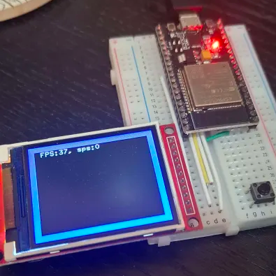

# ESP32-DMA-MultipleCore-TFTLCD

This project just for testing esp32's FPS



Only tested on LCD ili9225.

It's depence on esp-hal.

## Wires

| ESP32 | LCD |
| --- | --- |
| GPIO18 | SCK/CLK |
| GPIO23 | SDA |
| GPIO5  | CS |
| GPIO16  | DC/RS |
| GPIO17  | RST |

## Run

This project cannot running on debug mode, you will got oom when you running on debug mode.

```Bash
cargo run --release
```

## Double buffer and single buffer

Double buffer increase 7 FPS.

Single buffer have 30 FPS.